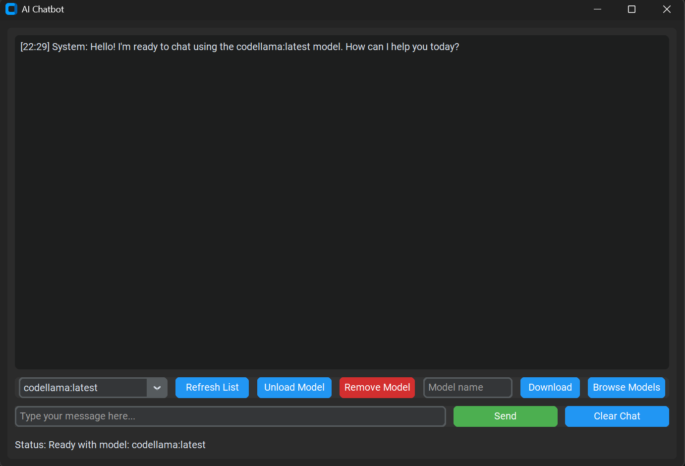

# AI Chatbot with Ollama Integration

A modern, desktop-based AI chatbot application that integrates with Ollama to provide a user-friendly interface for interacting with LLM models. Built with Python and CustomTkinter for a clean, modern look.



## Features

- 🤖 Integrated with Ollama LLM models
- 🎨 Modern dark-mode GUI using CustomTkinter
- 💬 Real-time chat interface
- 🔄 Automatic Ollama service management
- 📊 Model management and storage information
- 💾 Automatic model downloading
- 🧵 Multi-threaded for responsive UI
- ⌨️ Support for keyboard shortcuts

## Prerequisites

Before running the application, make sure you have:

1. Python 3.8 or higher installed
2. Ollama installed on your system ([Ollama Installation Guide](https://ollama.ai/download))
3. Required Python packages

## Installation

1. Clone the repository:
```bash
git clone https://github.com/gsudiro/Chatbot-Ollama.git
cd ai-chatbot
```

2. Create and activate a virtual environment (recommended):
```bash
python -m venv .venv
# On Windows:
.venv\Scripts\activate
# On macOS/Linux:
source .venv/bin/activate
```

3. Install required packages:
```bash
pip install customtkinter requests langchain-core langchain-ollama
# Or
pip install -r requirements.txt
```

## Usage

1. Start the application:
```bash
python main.py
```

2. The application will:
   - Automatically start Ollama service if not running
   - Check for and download required models
   - Initialize the chat interface

3. Features:
   - Type messages in the input field and press Enter or click Send
   - Click "Show Models" to view installed models and storage usage
   - Watch real-time status updates in the status bar

## Model Storage Locations

The models are stored by Ollama in the following locations:

- Linux: `/usr/share/ollama/models`
- macOS: `$HOME/.ollama/models`
- Windows: `C:\Users\%username%\.ollama\models`

## Technical Details

### Components

- **GUI**: Built with CustomTkinter for a modern look
- **LLM Integration**: Uses Langchain and Ollama
- **Threading**: Separate threads for UI and model operations
- **Error Handling**: Comprehensive error catching and user feedback

### Architecture

```
chatbot.py
├── ChatbotGUI (Main Class)
│   ├── UI Components
│   │   ├── Chat Display
│   │   ├── Input Field
│   │   ├── Send Button
│   │   └── Model Info Button
│   ├── Ollama Management
│   │   ├── Service Control
│   │   ├── Model Management
│   │   └── Status Updates
│   └── Chat Processing
       ├── Message Handling
       ├── Context Management
       └── Response Generation
```

## Key Methods

- `initialize_chatbot()`: Sets up Ollama and model
- `send_message()`: Handles message processing
- `list_installed_models()`: Shows model information
- `pull_model()`: Downloads required models
- `update_status()`: Updates UI status
- `add_message()`: Adds messages to chat display

## Contributing

Feel free to submit issues and pull requests. For major changes, please open an issue first to discuss what you would like to change.

## License

This project is licensed under the MIT License - see the LICENSE file for details.

## Acknowledgments

- [Ollama](https://ollama.ai/) for the LLM backend
- [CustomTkinter](https://github.com/TomSchimansky/CustomTkinter) for the modern UI
- [Langchain](https://www.langchain.com/) for the LLM integration framework